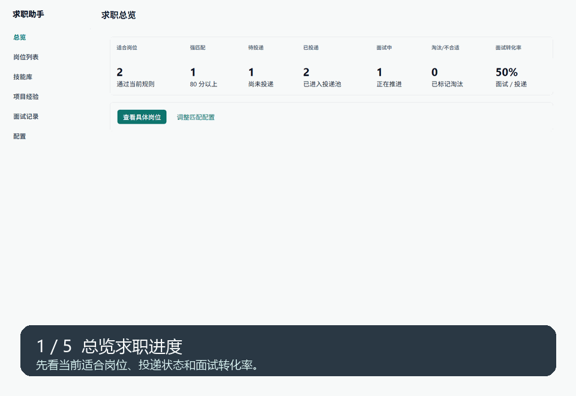

# 求职助手

一个本地运行的个人求职工作台。它不是单纯的爬虫，也不是一次性导出 Excel 的小工具，而是帮助你把“看岗位、收藏岗位、沉淀技能、记录面试、补齐短板”这件事长期管理起来。

当前第一期支持从 Boss 采集岗位，后续可以继续接入猎聘、拉勾、智联、前程无忧或手动录入。无论岗位来自哪里，进入本地库后都会进入同一套匹配分析、技能提炼、项目经验和面试复盘流程。

## 核心闭环

```text
岗位收集 -> 匹配分析 -> 技能点沉淀 -> 面试记录 -> 技能短板复盘 -> 项目经验补齐 -> 继续筛选岗位
```

这个工具更适合想认真换工作、需要长期跟踪多个岗位的人：看到合适岗位时收藏下来，后面可以持续维护投递状态、面试情况、被问到的技能点，以及哪些能力还需要补。

## 核心闭环演示

下面是一段基于演示数据生成的产品演示，展示从求职总览、岗位筛选、岗位详情、面试记录、技能沉淀到面试复盘的主流程。



## 主要功能

- 收藏岗位：用浏览器扩展读取当前打开的岗位详情，保存到本地库。
- 匹配分析：根据薪资、地点、公司规模、技术关键词、C 端经验、外包风险等规则打分。
- 岗位跟踪：维护待投递、已投递、面试中、已面试、Offer、淘汰、不合适等状态。
- 技能沉淀：从职位描述、加分项、优先录用和面试问题里提炼技能标签。
- 项目经验：记录能支撑技能点的项目，把“我会什么”和“我做过什么”连起来。
- 面试复盘：记录每次面试和问题表现，反向找出薄弱技能。
- 本地保存：数据默认保存在本机 SQLite，不上传到远端服务。

## 如何使用

### 方式一：使用 Windows 单文件程序

适合普通用户。拿到 `JobSearchAssistant.exe` 后双击运行，它会启动本地后台并打开浏览器页面。

首次使用还需要在 Chrome 或 Edge 里加载扩展：

1. 打开浏览器扩展管理页。
2. 开启“开发者模式”。
3. 选择“加载已解压的扩展程序”。
4. 选择 `%LOCALAPPDATA%\JobSearchAssistant\extension`。
5. 工具栏出现“求职助手”后，就可以在岗位详情页点击收藏。

### 收藏一个岗位

1. 用平时的浏览器正常打开招聘网站。
2. 当前第一期在 Boss 上手动打开一个感兴趣的岗位详情。
3. 点击浏览器扩展里的“收藏当前岗位”。
4. 回到 `http://127.0.0.1:8765` 查看岗位、匹配分析和后续跟进。

## 当前边界

为了避免触发招聘平台风控，本项目不做自动批量打开岗位、不循环点击详情页、不自动投递，也不接管浏览器。扩展只读取你当前已经手动打开并展示出来的岗位内容。

当前只实现 Boss 数据源，但内部已经按多来源预留：岗位唯一键使用 `source:source_job_id`，后续接入其他招聘网站时，只需要新增来源适配器，把页面数据转换成统一岗位字段。

## 数据位置

普通 exe 运行时，数据和配置默认放在：

```text
%LOCALAPPDATA%\JobSearchAssistant
```

开发模式下默认数据库为：

```text
output/boss_jobs.sqlite3
```

可以用 Navicat、DB Browser for SQLite 等工具查看 SQLite 数据。

## 项目目录

常用目录说明：

```text
src/          本地服务、SQLite 存储、匹配评分、桌面启动器
extension/    Chrome / Edge 扩展，负责读取当前岗位页面
docs/         使用说明、产品闭环、打包说明和产品截图
tests/        后端测试和扩展解析测试
scripts/      启动、打包、清理等脚本
installer/    Windows 安装包配置
```

本地运行时还会出现一些不会提交到 GitHub 的目录：

```text
dist/         打包后的 exe，发给朋友时主要用这里的文件
build/        打包中间产物，可清理
output/       开发模式下的本地 SQLite 数据库，谨慎删除
.tmp/         临时测试数据和截图缓存，可清理
.venv/        本地 Python 虚拟环境，重建成本较高，默认保留
```

想清理工作区时可以执行：

```powershell
.\scripts\clean_workspace.bat
```

默认不会删除 `dist`、`output` 和 `.venv`。如果确实要一起清理，可以显式加参数，例如 `--dist`、`--output`、`--venv` 或 `--all`。

## 文档

- [使用指南](docs/user-guide.md)
- [产品闭环](docs/product-loop.md)
- [开发说明](docs/development.md)
- [Windows 打包说明](docs/packaging.md)
- [用户体验 Review](docs/ux-review.md)
- [扩展手工测试](docs/extension-manual-test.md)

## 开发者入口

开发和测试命令放在 [开发说明](docs/development.md) 里。日常开发一般会用到：

```powershell
python -m pip install -r requirements-dev.txt
python -m pytest -v
node tests\extension\content_parser_test.js
node tests\extension\popup_static_test.js
```
